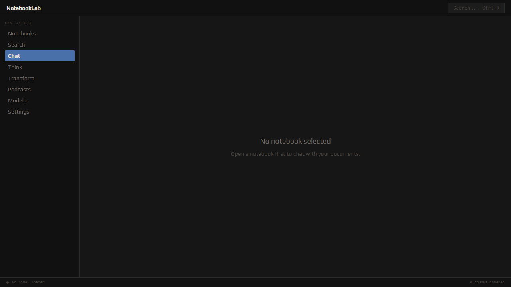

<div align="center">

# NotebookLab

**Your thinking partner, on your machine.**

Import your documents. Ask questions. Get answers with sources.
All of it runs locally.

[](https://github.com/Amey-Thakur/NotebookLab/actions/workflows/ci.yml)
[](https://github.com/Amey-Thakur/NotebookLab/releases/latest)
[](LICENSE)

[Download](https://github.com/Amey-Thakur/NotebookLab/releases/latest) · [Website](https://amey-thakur.github.io/NotebookLab/) · [Contributing](CONTRIBUTING.md)



</div>

---

## What it does

NotebookLab combines the research power of an AI notebook with the privacy of
local software. Your documents never leave your computer.

| | |
|---|---|
| **Ask your documents** | RAG chat grounded in your PDFs, notes, and Markdown files. Every answer lists its sources with document, heading, and page. |
| **Write connected notes** | A WYSIWYG Markdown editor with `[[wiki-links]]`, backlinks, and auto-save. |
| **Search everything** | Keyword search with BM25 ranking, blended with semantic similarity when embeddings are available. |
| **Think out loud** | Generate mind maps from your research, or get Socratic questions that push your thinking. |
| **Transform documents** | Summaries, key points, or any custom instruction, applied to a whole document. |
| **Listen instead** | Turn a notebook into a two-voice podcast script, read aloud offline. |
| **Bring any model** | One-click local model download, a bundled llama.cpp server, or connect Ollama, LM Studio, and OpenAI-compatible APIs. |

## Install

Grab the installer for your platform from the
[latest release](https://github.com/Amey-Thakur/NotebookLab/releases/latest):

| Platform | File |
|----------|------|
| Windows | `.msi` or `-setup.exe` |
| macOS (Apple Silicon) | `aarch64.dmg` |
| macOS (Intel) | `x64.dmg` |
| Linux | `.AppImage`, `.deb`, or `.rpm` |

The app checks for updates automatically. Verify downloads with the
`SHA256SUMS` file attached to each release.

macOS builds are not yet notarized with Apple. On first open, right-click the
app and choose Open, or run
`xattr -dr com.apple.quarantine /Applications/NotebookLab.app` once.

## First run

1. NotebookLab opens with a **Getting Started** notebook and two sample notes.
2. Open **Models** and either download the bundled model (~2 GB, one time) or
   connect a provider you already run, like Ollama.
3. Import a PDF, TXT, or Markdown file into a notebook.
4. Open **Chat** and ask a question about it.

## Develop

Prerequisites: [Node.js](https://nodejs.org/) 22+, [Rust](https://rustup.rs/) 1.77+.
On Linux you also need the WebKitGTK stack:

```bash
sudo apt-get install libwebkit2gtk-4.1-dev libappindicator3-dev librsvg2-dev patchelf
```

```bash
git clone https://github.com/Amey-Thakur/NotebookLab.git
cd NotebookLab

npm ci                      # frontend dependencies
npm run sidecar:download    # llama-server binary + libraries (checksum verified)

npx tauri dev               # run the app
```

Quality gates, all enforced in CI:

```bash
npm run lint                # eslint
npm test                    # vitest
npm run build               # typecheck + bundle
cargo fmt --check           # in src-tauri/
cargo clippy -- -D warnings # in src-tauri/
cargo test                  # in src-tauri/
```

## Architecture

```
React 19 frontend (src/)
    |
    Tauri IPC, snake_case arguments
    |
Rust backend (src-tauri/src/)
    commands/      thin async IPC handlers
    services/      RAG, ingestion, search, embeddings, sidecar lifecycle
    providers/     LLM abstraction (any OpenAI-compatible API)
    parsers/       PDF, TXT, Markdown
    database/      SQLite repositories (WAL, FTS5, cascade deletes)
    api/           local REST server on 127.0.0.1:8484
```

Every module is self-contained. Removing one does not break the others.

## Local REST API

The app serves a read-only API for scripts on your machine at
`http://127.0.0.1:8484`. All endpoints except `/api/health` require the
session token shown in **Settings**, which changes on every launch.

```bash
curl -H "Authorization: Bearer <token>" http://127.0.0.1:8484/api/notebooks
```

| Endpoint | Returns |
|----------|---------|
| `GET /api/health` | version and status (no auth) |
| `GET /api/notebooks` | all notebooks |
| `GET /api/notebooks/{id}/notes` | notes in a notebook |
| `GET /api/notebooks/{id}/documents` | documents in a notebook |
| `GET /api/documents/{id}/chunks` | extracted passages of a document |
| `GET /api/chunks/count` | total indexed chunks |

## Privacy

- Documents, notes, chats, and embeddings live in a local SQLite database.
- The bundled model and llama.cpp server run entirely offline.
- Cloud providers are optional, off by default, and only receive the context
  for the specific question you ask.
- The REST API binds to localhost only and requires a per-session token.

## Contributing

See [CONTRIBUTING.md](CONTRIBUTING.md) for setup, conventions, and the pull
request checklist, and [SECURITY.md](SECURITY.md) for reporting
vulnerabilities. Release steps live in [RELEASING.md](RELEASING.md).

## License

[MIT](LICENSE)

## Authors

- [Amey Thakur](https://github.com/Amey-Thakur)
- [Archit Konde](https://github.com/Archit-Konde)
