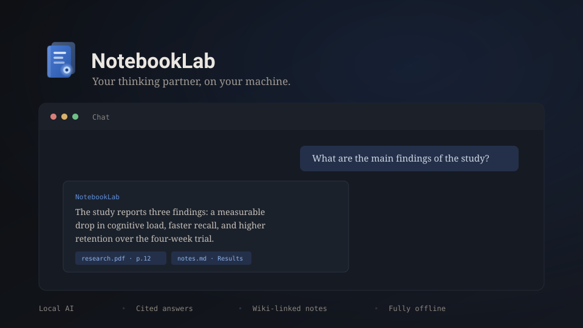
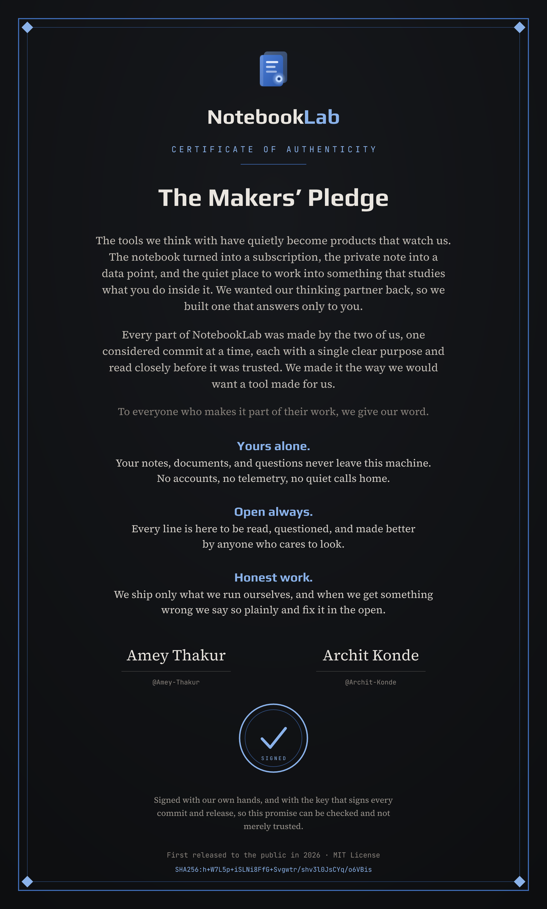

<div align="center">

<br>


# NotebookLab

**Your thinking partner, on your machine.**

<br>

Import your documents. Ask questions. Get answers with sources.
Write connected notes, search everything, and let a local AI
help you think. Nothing leaves your computer.

<br>

[](LICENSE)
[](https://github.com/Amey-Thakur/NotebookLab/actions/workflows/ci.yml)
[](https://github.com/Amey-Thakur/NotebookLab/releases/latest)
[](https://github.com/Amey-Thakur/NotebookLab/graphs/contributors)

[**Download**](https://github.com/Amey-Thakur/NotebookLab/releases/latest) &nbsp;·&nbsp;
[**Website**](https://amey-thakur.github.io/NotebookLab/) &nbsp;·&nbsp;
[**Contributing**](.github/CONTRIBUTING.md)

<br>

**[Read the Handbook (PDF)](docs/notebooklab-handbook.pdf)** &nbsp;·&nbsp; twelve pages on what it
does, why every answer carries its source, and how we built it

<br>



<br>

</div>

**Jump to:**
[What it does](#what-it-does) ·
[Install](#install) ·
[First run](#first-run) ·
[Develop](#develop) ·
[Architecture](docs/ARCHITECTURE.md) ·
[REST API](#local-rest-api) ·
[Privacy](#privacy) ·
[Handbook](#handbook)

<br>

## What it does

- **Ask your documents.** Chat grounded in your PDFs, Word files, notes, and
  Markdown. Every answer lists its sources with document, heading, and page.

- **Bring in anything.** Import PDF, Word (`.docx`), text, and Markdown, or an
  image or scan of printed text that offline OCR turns into searchable content.

- **Write connected notes.** A clean Markdown editor with `[[wiki-links]]`,
  backlinks, and auto-save.

- **Search everything.** Keyword ranking blended with semantic similarity
  when embeddings are available.

- **Think out loud.** An Idea Space that maps the claims, evidence, tensions,
  and open questions across your sources in three dimensions, or Socratic
  questions that push your thinking further.

- **Sketch on a canvas.** One open space per notebook to draw, drop in images,
  add shapes and text, and arrange it all. It saves with the notebook.

- **Share a notebook.** Export a notebook as one self-contained file and import
  it on another machine. Offline, no source files needed.

- **Transform documents.** Summaries, key points, or any custom instruction.

- **Craft prompts.** Prompt Studio builds a clear prompt from simple parts and
  can sharpen it with your model.

- **See the shape of things.** A document outline tree and a notes connection
  map make a large body of work easy to navigate.

- **Listen instead.** The Audio Studio reads a notebook aloud offline, told the
  way you want it: a discussion, a brief, an interview, a lecture, a run of
  questions, a debate, or a critique.

- **Bring any model.** A bundled offline llama.cpp server, a curated catalog
  of open models installed through Ollama in one click, and first-class cloud
  connections for Anthropic Claude, OpenAI, Google Gemini, and DeepSeek with
  your own API key. A header model menu switches between them instantly, or
  turn on Auto and the best model is picked per task with automatic fallback.
  A live status-bar counter shows real token use and context-window fill.

- **See the shape of your work.** Note connections render as a 3D map you can
  rotate, zoom, and click through (no libraries, our own tiny engine), and
  the same map is handed to the AI so answers know how your notes relate.

- **Open files with it.** Right-click a PDF, Word, text, or Markdown file and
  choose NotebookLab: it lands in your notebook, indexed and ready to ask
  about. Already-running windows pick the file up instead of starting twice.

- **Move fast.** One keyboard-first search box, go-to shortcuts (`G` then a
  key), and a cheat sheet on `?`. Press once, land anywhere. Pages load on
  demand, so the app starts light.

<br>

## Install

Download the installer for your platform from the
[latest release](https://github.com/Amey-Thakur/NotebookLab/releases/latest).

| Platform | File |
|----------|------|
| Windows | `.msi` or `-setup.exe` |
| macOS (Apple Silicon) | `aarch64.dmg` |
| macOS (Intel) | `x64.dmg` |
| Linux | `.deb` or `.rpm` |

The app updates itself on Windows and macOS. Verify any download against the
`SHA256SUMS` file attached to the release.

> [!WARNING]
> **macOS will refuse to open it the first time.** The builds are signed but not
> yet notarized with Apple, so Gatekeeper blocks them. Right-click the app and
> choose Open, or run this once:
> ```
> xattr -dr com.apple.quarantine /Applications/NotebookLab.app
> ```
> The pipeline is already wired for notarization and switches on the moment
> Apple credentials are added.

<br>

## First run

1. A short welcome greets you on the first launch and opens with a Getting
   Started notebook and two sample notes.
2. Open **Models**, then pick a path: download the bundled model (one 2 GB
   download), install an open model through Ollama with one click, or connect
   a cloud provider (Claude, GPT, Gemini, DeepSeek) with your API key.
3. Import a PDF, Word, text, Markdown, or image file into a notebook.
4. Open **Chat** and ask a question about it.
5. Press `?` any time for the full list of keyboard shortcuts.

> [!TIP]
> **Pick a model that fits your machine, not the biggest one.** On a laptop with
> no GPU, something in the 3 to 4B instruct range answers while you are still
> watching. A 7B reasoning model on a CPU can think for minutes before its first
> word, which looks exactly like the app has hung.

<br>

## Handbook

The Handbook covers what NotebookLab is, why every answer carries its
source, and how to get from download to a first answer. Twelve pages,
including a note from both of us on why we built it this way and the
signed Makers' Pledge.

**[Read the Handbook](docs/notebooklab-handbook.pdf)** &middot; the reference
cards and brand assets are in the [press kit](docs/press-kit/).

<br>

## Develop

You need [Node.js](https://nodejs.org/) 22+ and [Rust](https://rustup.rs/) 1.89+.
On Linux, install the WebKitGTK stack first:

```bash
sudo apt-get install libwebkit2gtk-4.1-dev libappindicator3-dev librsvg2-dev patchelf
```

Then:

```bash
git clone https://github.com/Amey-Thakur/NotebookLab.git
cd NotebookLab

npm ci                      # frontend dependencies
npm run sidecar:download    # local AI server, checksum verified
npm run models:download     # OCR models for image import, checksum verified

npx tauri dev               # run the app
```

Quality gates, all enforced in CI on Linux, Windows, and macOS:

```bash
npm run lint
npm test
npm run build

cd src-tauri
cargo fmt --all -- --check
cargo clippy --all-features -- -D warnings
cargo test
```

<br>

## How it is built

```
src/            React 19 frontend, organized by feature
src-tauri/      Rust backend
  commands/       async IPC handlers
  services/       RAG, ingestion, search, embeddings, sidecar lifecycle
  providers/      LLM abstraction: OpenAI-compatible, Anthropic, Gemini
  parsers/        PDF, Word (.docx), text, Markdown, image OCR
  database/       SQLite repositories (WAL, FTS5, cascade deletes)
  api/            local REST server on 127.0.0.1:8484
site/           landing page
scripts/        build helpers
config/         build configs (Vite, ESLint, Tailwind, TypeScript)
docs/           guides, architecture, brand assets
```

Each module is self-contained and has one purpose. Removing one does not
break the others. Diagrams of the full system, the question-answering
pipeline, the local server lifecycle, and the data model live in
[docs/ARCHITECTURE.md](docs/ARCHITECTURE.md).

<br>

## Local REST API

The app serves a read-only API for scripts on your machine at
`http://127.0.0.1:8484`. Every endpoint except `/api/health` requires the
session token shown in **Settings**.

```bash
curl -H "Authorization: Bearer <token>" http://127.0.0.1:8484/api/notebooks
```

| Endpoint | Returns |
|----------|---------|
| `GET /api/health` | version and status, no auth |
| `GET /api/notebooks` | all notebooks |
| `GET /api/notebooks/{id}/notes` | notes in a notebook |
| `GET /api/notebooks/{id}/documents` | documents in a notebook |
| `GET /api/documents/{id}/chunks` | extracted passages of a document |
| `GET /api/chunks/count` | total indexed chunks |

<br>

## Privacy

> [!NOTE]
> With a local model there is no request to make, so there is nothing to
> intercept: it works with the network cable out. Add a cloud key and the
> context for that one question does go to that provider, which is exactly why
> cloud is a choice rather than the default.

Your documents, notes, chats, and embeddings live in a local SQLite database.
The bundled model runs entirely offline. Cloud providers are optional, off by
default, and only ever receive the context for the question you ask. The REST
API binds to localhost and requires a fresh token every session.

<br>

## Community

Questions and ideas live in
[Discussions](https://github.com/Amey-Thakur/NotebookLab/discussions), and
the [FAQ](docs/FAQ.md) answers the common ones directly. Bugs go through
[issues](https://github.com/Amey-Thakur/NotebookLab/issues/new/choose).

Contributions start with the [contributing guide](.github/CONTRIBUTING.md).
Security issues go through the [security policy](.github/SECURITY.md), and
maintainers cut releases with [docs/RELEASING.md](docs/RELEASING.md).

<br>

## The Makers' Pledge

Our promise to everyone who trusts NotebookLab with their thinking: your work
stays on your machine, the source stays open, and we ship only what we run
ourselves. It carries the fingerprint of the same key that signs every commit
and release, so the promise can be checked, not merely trusted.

<div align="center">

<a href="site/makers-pledge.png"></a>

[**Download the certificate**](https://raw.githubusercontent.com/Amey-Thakur/NotebookLab/main/site/makers-pledge.png) &nbsp;·&nbsp; [Read the full pledge](docs/AUTHORS.md)

</div>

<br>

## License and authors

Released under the [MIT License](LICENSE). The app ships with open source
work by others, credited in [THIRD-PARTY-LICENSES.md](THIRD-PARTY-LICENSES.md):
the llama.cpp inference server, the ocrs OCR engine and rten runtime, and the
Play, Source Serif 4, and JetBrains Mono typefaces.

Built by [Amey Thakur](https://github.com/Amey-Thakur) and
[Archit Konde](https://github.com/Archit-Konde). Their story, and the
pledge they sign their names to, is in [The Makers](docs/AUTHORS.md)
and on the About page inside the app.
