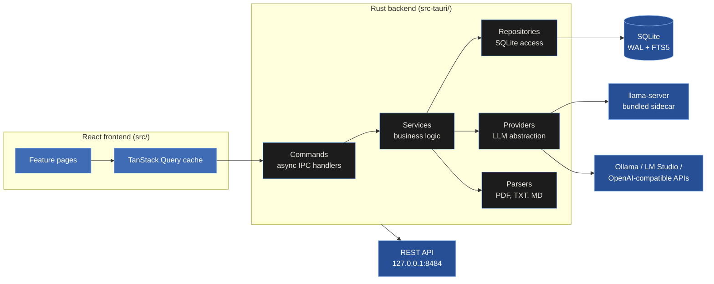
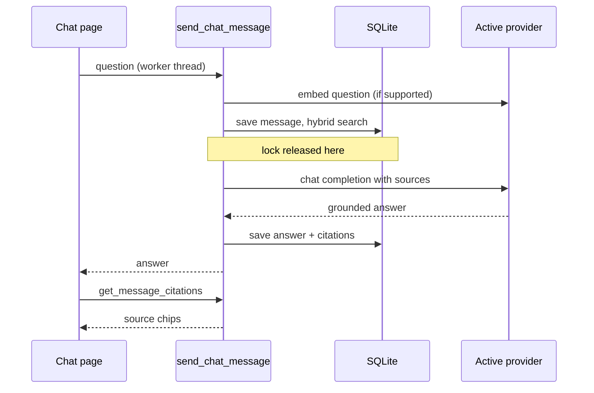
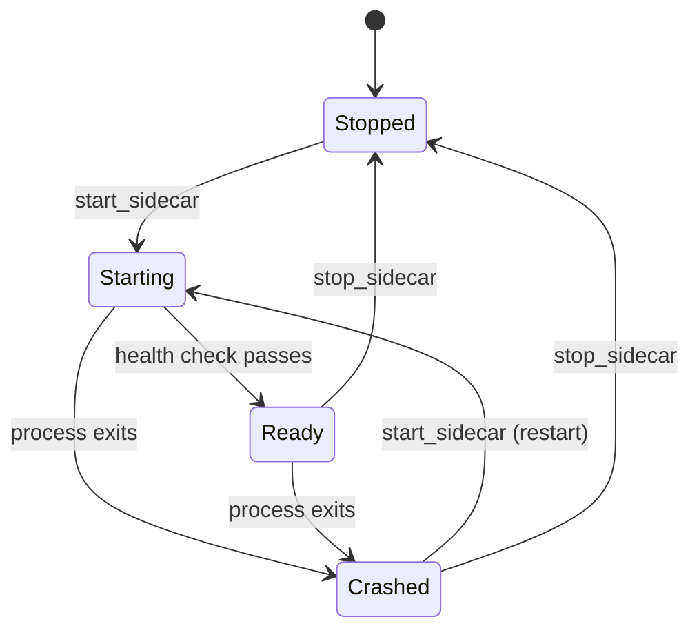
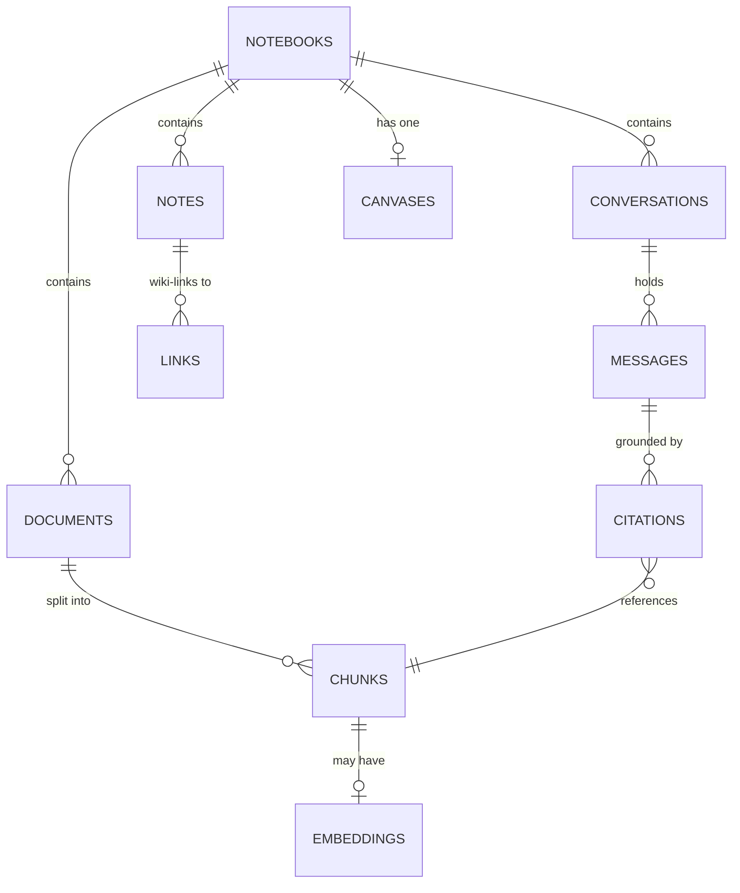

# Architecture

How NotebookLab is put together, and why. Ten minutes of reading covers
everything you need before touching the code.

**Jump to:**
[The big picture](#the-big-picture) ·
[Asking a question](#what-happens-when-you-ask-a-question) ·
[The local AI server](#the-local-ai-server) ·
[Data model](#data-model) ·
[Design rules](#design-rules)

 

## The big picture

Two processes, one contract. The React frontend renders everything; the Rust
backend owns everything: data, AI calls, files. They speak over Tauri IPC
with snake_case arguments, enforced by tests on both sides.

Each layer only talks to the one below it. Commands never touch SQL,
services never touch IPC, repositories never call providers. That is what
keeps every module removable.

 

## What happens when you ask a question

The chat pipeline runs in phases so no lock is ever held during a slow step.
The database lock is released before the model call, which can take two
minutes on a laptop.

Retrieval is hybrid: FTS5 keyword ranking always works; when the provider
supports embeddings, vector similarity is blended in with reciprocal rank
fusion. No embeddings means keyword search, never a failure.

 

## The local AI server

The installer bundles `llama-server` from llama.cpp along with the shared
libraries it loads. The app manages it as a state machine; every state has
an exit.

Ground rules the code enforces:

- The server binds to `127.0.0.1` on a random port with a fresh key every
  launch, passed through `LLAMA_API_KEY`.
- When it becomes ready, it registers itself as the active provider,
  replacing any entry from a previous run.
- Quitting the app kills the child process. No orphans.
- A crash deactivates the dead provider so chat says "no model connected"
  instead of a network error.

 

## Data model

Everything lives in one SQLite database in the app data directory, in WAL
mode with foreign keys on. Deleting a notebook cascades through everything
it contains.

Chunks carry their heading and page so citations can say where an answer
came from. Documents are parsed from PDF, Word, text, Markdown, and images
(read with offline OCR) into the same chunk shape, so everything downstream
treats them alike. Each notebook has one canvas whose scene is stored as a
JSON document. The links table is rebuilt from `[[wiki-link]]` syntax on every
note save and powers the backlinks panel. A notebook can be exported to a
single self-contained file (notebook, notes, documents as chunks, and canvas)
and imported to recreate it on another machine.

 

## Design rules

These are the rules the codebase actually follows, enforced by CI where a
machine can check them:

| Rule | Enforced by |
|------|-------------|
| IPC arguments are snake_case on both sides | Rust and TypeScript tests |
| Long work never runs on the main thread | async commands + spawn_blocking |
| Every SQL statement is parameterized | code review, grep-clean |
| Every file starts with the standard header | codemod + review |
| Errors reach users as plain language | formatError / AppError |
| Formatting is not a matter of opinion | cargo fmt gate, eslint |
| Third-party binaries are checksum pinned | sidecar download script |
| A release ships whole or not at all | publish job needs all platforms |
